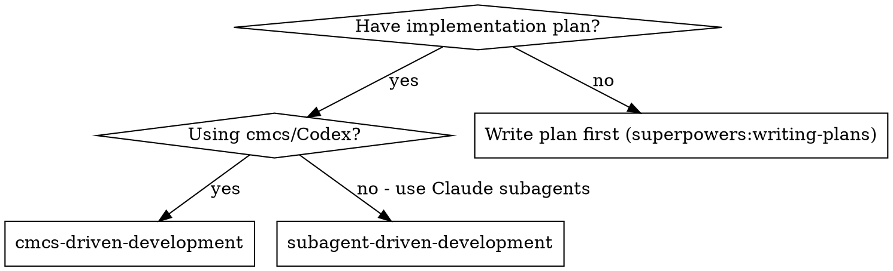
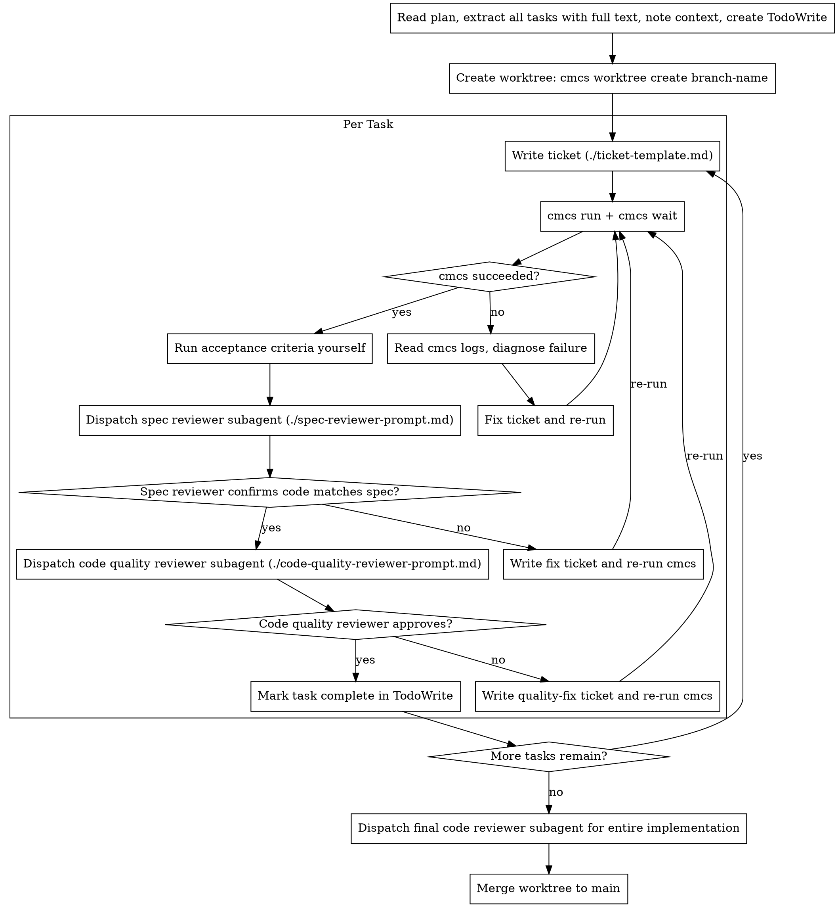

# cmcs-Driven Development

Execute plan by writing cmcs tickets for Codex agents, with two-stage Claude review after each: spec compliance review first, then code quality review.

**Core principle:** Codex implements via tickets + Claude reviews (spec then quality) = high quality, orchestrator never implements

## When to Use



**vs. Subagent-Driven Development:**
- Codex agents implement (not Claude subagents)
- Tickets must be fully self-contained (Codex can't ask questions)
- Async execution via `cmcs run` + `cmcs wait`
- Model selection matters (gpt-5.3-codex vs spark)
- Claude subagents still handle review (spec + quality)

**For large projects (10+ files, multi-phase):** Read `agents/process/cmcs-large-implementation-preparation.md` first — it covers research, design docs, phased execution, and handover documents.

## The Process



## Ticket Writing

See `./ticket-template.md` for the full template. Model selection and ticket format are in `agents/process/cmcs-base.md`.

**Critical:** Tickets must be completely self-contained. Codex agents cannot ask questions, read the plan file, or access files outside their worktree. Everything they need must be in the ticket itself.

## Prompt Templates

- `./ticket-template.md` - Write cmcs tickets for Codex agents
- `./spec-reviewer-prompt.md` - Dispatch spec compliance reviewer (Claude subagent)
- `./code-quality-reviewer-prompt.md` - Dispatch code quality reviewer (Claude subagent)

## Worktree Strategy

See `agents/process/cmcs-base.md` for dispatch strategy, parallel launch pattern, and commands.

## Example Workflow

```
You: I'm using cmcs-Driven Development to execute this plan.

[Read plan file once: agents/plans/feature-plan.md]
[Extract all 5 tasks with full text and context]
[Create TodoWrite with all tasks]
[Create worktree: cmcs worktree create feat/new-feature]

Task 1: Add supply helper

[Write TICKET-001.md with full task text, context, acceptance criteria]
[Copy ticket to worktree: cp to worktrees/feat/new-feature/.cmcs/tickets/]
[cmcs run worktrees/feat/new-feature]
[cmcs wait worktrees/feat/new-feature]

cmcs: Completed (1/1 tickets passed)

[Run acceptance criteria: npm run build, npm test — all pass]

[Dispatch spec compliance reviewer (Claude subagent)]
Spec reviewer: APPROVED — all requirements met, nothing extra

[Get git SHAs, dispatch code quality reviewer (Claude subagent)]
Code reviewer: Strengths: Good. Issues: None. Approved.

[Mark Task 1 complete]

Task 2: Refactor price enrichment

[Write TICKET-002.md with full context]
[Copy to worktree, cmcs run, cmcs wait]

cmcs: Completed (1/1 tickets passed)

[Run acceptance criteria — all pass]

[Dispatch spec compliance reviewer]
Spec reviewer: ISSUES:
  - Missing: Fallback to CMC when DL has no price (spec requirement)
  - Extra: Added DexScreener as a source (not requested)

[Write TICKET-002-fix.md: "Add CMC fallback, remove DexScreener addition"]
[cmcs run, cmcs wait]

[Dispatch spec reviewer again]
Spec reviewer: APPROVED

[Dispatch code quality reviewer]
Code reviewer: Strengths: Solid. Issues (Important): Magic timeout value

[Write TICKET-002-quality.md: "Extract PRICE_FETCH_TIMEOUT constant"]
[cmcs run, cmcs wait]

[Dispatch code quality reviewer again]
Code reviewer: APPROVED

[Mark Task 2 complete]

...

[After all tasks]
[Dispatch final code reviewer for entire worktree diff]
Final reviewer: All requirements met, ready to merge

[Merge worktree to main]
Done!
```

## Advantages

**vs. Subagent-Driven Development:**
- Codex handles heavy implementation (cost-efficient)
- Tickets create audit trail of exactly what was requested
- Model selection optimizes cost/quality per task
- Parallel worktrees for independent tasks (true parallelism)

**vs. Raw cmcs (no structured review):**
- Two-stage review catches spec drift and quality issues
- Review loops ensure fixes actually work
- Spec compliance prevents over/under-building by Codex
- Code quality ensures maintainable output

**Quality gates:**
- Acceptance criteria run by orchestrator (not trusted from Codex)
- Spec compliance review by Claude subagent (independent verification)
- Code quality review by Claude subagent (catches what Codex misses)
- Review loops ensure fixes are verified
- Final review catches cross-task integration issues

## Red Flags

See `agents/process/cmcs-base.md` for general cmcs rules. Additional review-specific red flags:

- **Start code quality review before spec compliance is APPROVED** (wrong order)
- Skip reviews (spec compliance OR code quality)
- Move to next task while either review has open issues
- Skip the re-review after a fix ticket
- Trust Codex's self-reported success (run acceptance criteria yourself)

**If reviewer finds issues:**
1. Write a targeted fix ticket describing exactly what to change
2. Run cmcs again in the same worktree
3. Re-dispatch the same reviewer
4. Repeat until approved

**Trivial fixes only:** If a review issue is a one-line change (rename a constant, fix a typo), the orchestrator MAY fix it directly rather than writing a ticket. Use judgment — if there's any complexity, write a ticket.

## Integration

**Required process docs:**
- **`agents/process/cmcs-base.md`** — cmcs commands, ticket format, rules
- **`agents/process/cmcs-large-implementation-preparation.md`** — For large projects (10+ files)

**Required workflow skills:**
- **superpowers:writing-plans** — Creates the plan this skill executes
- **superpowers:requesting-code-review** — Code review template for reviewer subagents
- **superpowers:verification-before-completion** — Verify before claiming done

**Review subagents use:**
- **superpowers:requesting-code-review** — Code quality review template

**Alternative workflow:**
- **superpowers:subagent-driven-development** — Use Claude subagents instead of Codex for implementation
