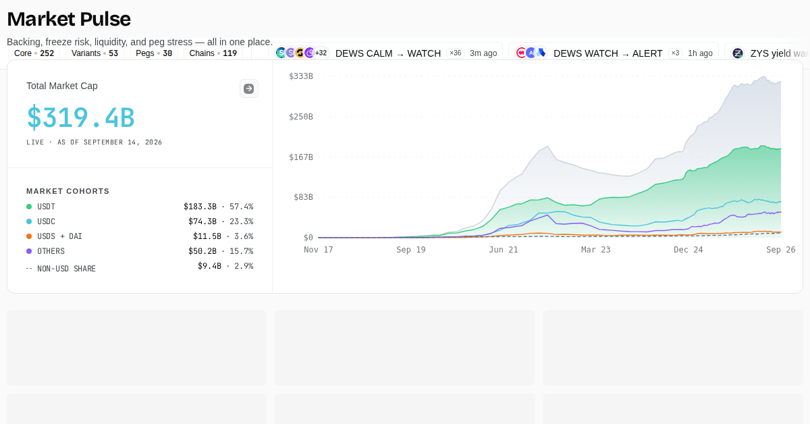

# Pharos — Stablecoin Analytics Dashboard

[](https://pharos.watch)
[](https://github.com/TokenBrice/pharos-watch/actions/workflows/pull-request-checks.yml)
[](https://github.com/TokenBrice/pharos-watch/actions/workflows/codeql.yml)
[](./LICENSE)

Pharos is an open-source stablecoin intelligence dashboard tracking 409 stablecoins in repo metadata: 364 active assets on public data surfaces, 34 pre-launch entries, 11 frozen historical archives, 88 curated dead stablecoins in the cemetery dataset, and 2 PSI-only shadow assets. It is a pure information site: no wallet connectivity, no trading, no custody, and no user accounts.

Pharos is research infrastructure, not financial advice. Data can be delayed, incomplete, or degraded when upstream providers fail; public surfaces include freshness and status signals so users can judge whether a snapshot is current enough for their use case.

- **Use it:** [pharos.watch](https://pharos.watch)
- **API access:** [pharos.watch/api](https://pharos.watch/api/)
- **Methodology:** [pharos.watch/methodology](https://pharos.watch/methodology/)
- **Status:** [pharos.watch/status](https://pharos.watch/status/)
- **Discuss:** [GitHub Discussions](https://github.com/TokenBrice/pharos-watch/discussions)



## What Pharos Tracks

- **Peg health:** 15-minute peg monitoring, Peg Score, depeg detection, direction tracking, and historical depeg timelines.
- **Issuer controls:** FreezeWatch provides on-chain tracking of 35 stablecoins, covering freeze, blacklist, and seize events for supported issuer-controlled assets across major chains.
- **Liquidity quality:** DEX Liquidity Score combines pool TVL, volume, durability, pool quality, and pair diversity.
- **DEX price corroboration:** Curve, Uniswap V3, Aerodrome, Velodrome, Fluid, Balancer, Raydium, Orca, Meteora, PancakeSwap, and DexScreener inputs help suppress false depeg alerts.
- **Market structure:** USD, non-USD fiat, commodity, and CPI-linked stablecoin cohorts with chain and peg distribution views.
- **Risk context:** safety report cards, Bluechip ratings, redemption backstops, dependency mapping, mint/burn flows, live reserves, and yield intelligence where coverage exists.
- **Lifecycle coverage:** upcoming stablecoins, frozen archives, and the Stablecoin Cemetery for retired or failed assets.
- **Public integration:** authenticated public API keys, OpenAPI/Postman artifacts, static dataset mirrors, and RSS/JSON feed routes.

## Data And Methodology

Pharos combines market, oracle, exchange, on-chain, DEX, reserve, issuer, and editorial sources behind a Cloudflare Worker. The frontend never calls third-party providers directly.

Key live source families include DefiLlama, CoinGecko, CoinMarketCap, Binance, Kraken, Coinbase Exchange, Bitstamp, Pyth, RedStone, Chainlink, Curve, The Graph, GeckoTerminal, DexScreener, Jupiter, Etherscan, TronGrid, dRPC, Alchemy, Frankfurter, Open Exchange Rates, gold-api.com, FRED/New York Fed/Treasury/ECB/SIX benchmark feeds, Bluechip, and protocol-specific reserve or redemption endpoints.

Reliability guardrails include:

- structural validation before cache publication
- compare-and-swap cache writes for concurrent sync safety
- source-specific circuit breakers and retry policy
- DEX price cross-validation before severe depeg publication
- BigInt-safe issuer-control amount handling
- cross-currency FX normalization for non-USD totals
- freshness metadata and status surfaces for public consumers

Start with:

- [About Pharos](https://pharos.watch/about/)
- [Methodology](https://pharos.watch/methodology/)
- [API reference](https://pharos.watch/about/api/)
- [Documentation index](./docs/README.md)

## Repository Map

```text
src/          Next.js 16 static frontend, route pages, components, hooks
functions/    Cloudflare Pages Functions for same-origin site/ops proxying
shared/       Runtime-neutral data, types, endpoint registry, scoring helpers
worker/       Cloudflare Worker API, cron jobs, D1 persistence, admin routes
docs/         Verified product, architecture, methodology, and runbook docs
.github/      CI, security scanning, dependency policy, issue templates
```

Detailed architecture and route ownership live in [docs/architecture.md](./docs/architecture.md) and [docs/agent-task-router.md](./docs/agent-task-router.md).

## Local Development

Use Node 24 LTS. The repo pins the current release-parity version in [.nvmrc](./.nvmrc).

```bash
nvm use
npm ci
npm run dev
```

Frontend-only work usually needs only `npm run dev`. Full Worker work needs Cloudflare bindings and provider credentials:

```bash
cd worker
npx wrangler dev
```

Useful checks:

```bash
npm run lint
npm run typecheck
npm run test
npm run test:merge-gate
```

Use `npm install` instead of `npm ci` only when intentionally changing dependencies.

## Contributing

Good public contribution lanes are data corrections, source coverage improvements, docs/API examples, bug reports, accessibility fixes, and small UI quality improvements that preserve the existing Pharos design language.

Read [CONTRIBUTING.md](./CONTRIBUTING.md) before opening a pull request. Data corrections should include source links and timestamps. Feature ideas usually belong in [Discussions](https://github.com/TokenBrice/pharos-watch/discussions) before implementation.

## Security

Please do not report vulnerabilities in public issues. Use the private vulnerability reporting instructions in [SECURITY.md](./SECURITY.md).

## License

Pharos is open source under the [MIT License](./LICENSE).
